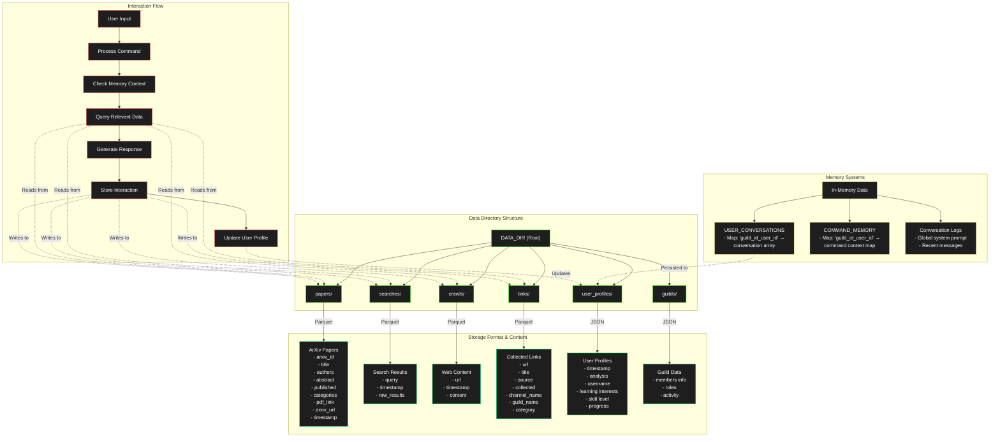

# OARC Discord Teacher

<div align="center">
  
  <br>
  <h3>Bringing AI-powered learning to your Discord server</h3>
</div>

A powerful Discord bot that helps your community learn about AI, Machine Learning, and programming concepts using Ollama's LLM capabilities. The bot features multiple learning modes, conversation memory, and personalized interactions while storing information locally for quick retrieval.

## About Ollama Teacher

Ollama Teacher is designed to make advanced AI learning accessible through Discord. Using Ollama's powerful LLMs locally, the bot serves as a dedicated learning assistant that can explain complex topics, analyze papers, search for information, and even understand documentation on the fly.

## 🎯 Key Features

### 🧠 Personal Memory System
- **Persistent Memory**: Use `--memory` flag to maintain context across conversations
- **User-Specific History**: Each user gets their own conversation history
- **Automatic Profile Analysis**: Bot analyzes user interactions every 30 minutes
- **Personal Learning Paths**: Tracks individual progress and interests

### 🤖 Multiple Learning Modes
- **ArXiv Research Mode**: Access and analyze academic papers
- **Web Search Mode**: AI-enhanced DuckDuckGo search results
- **Documentation Crawler**: Extract and explain content from websites
  - *Special handling for PyPI documentation* to provide accurate package information
- **Data Analysis Engine**: Query stored information using natural language
- **Vision Analysis**: Process and analyze images with `--llava` flag
- **Enhanced Processing**: Use Groq's API with `--groq` flag for improved responses

### 👤 Personalized Experience
- **Name Recognition**: Bot addresses users by their Discord names
- **Progress Tracking**: Maintains user profiles with learning analytics
- **Adaptive Responses**: Tailors explanations based on user history
- **Role-Based Access**: Special commands for admins and server owners

### 💾 Smart Data Management
- **Local Storage**: Parquet-based storage for efficiency
- **Profile Analysis**: Regular updates of user learning patterns
- **Multi-Source Memory**: Retains context from various information sources
- **Secure Reset Options**: Both personal and admin-level resets

### 🤖 Discord Integration
- Mention-based command system that doesn't conflict with other bots
- Support for file attachments to share and analyze code
- Image processing capabilities with vision models
- Long message chunking for comprehensive explanations
- Customizable appearance and behavior
- Graphical management interface for monitoring and configuration

## 📋 Commands

All commands require mentioning the bot: `@Ollama Teacher command`

### Basic Commands
| Command | Description | Example |
|---------|-------------|---------|
| `!help` | Display help information | `@Ollama Teacher !help` |
| `!reset` | Reset your personal context | `@Ollama Teacher !reset` |
| `!globalReset` | Reset all contexts (admin only) | `@Ollama Teacher !globalReset` |
| `!learn` | Get default resources | `@Ollama Teacher !learn` |
| `!profile` | View your learning profile | `@Ollama Teacher !profile` |

### Learning Commands
| Command | Description | Example |
|---------|-------------|---------|
| `!arxiv <id> [--memory] [--groq] <question>` | Learn from papers with memory or Groq API | `@Ollama Teacher !arxiv --memory --groq 1706.03762 What is self-attention?` |
| `!ddg <query> [--groq] [--llava] <question>` | Search with DuckDuckGo, with optional Groq API or image analysis | `@Ollama Teacher !ddg --groq "ollama api" How do I use it?` |
| `!crawl <url> [--groq] <question>` | Analyze web content with optional Groq API | `@Ollama Teacher !crawl --groq https://pypi.org/project/ollama/ Usage examples?` |
| `!pandas <query>` | Query stored data | `@Ollama Teacher !pandas Show recent searches` |
| `!links [limit]` | Collect links from messages | `@Ollama Teacher !links 500` |

### Special Features
| Feature | Description | Example |
|---------|-------------|---------|
| `--groq` | Use Groq's API instead of local Ollama for potentially improved responses | `@Ollama Teacher !arxiv --groq 1706.03762 Explain this paper` |
| `--llava` | Process attached images using vision model | `@Ollama Teacher --llava [attach image] What's in this image?` |
| `--memory` | Enable persistent memory for ongoing conversations (works with arxiv command) | `@Ollama Teacher !arxiv --memory 1706.03762 Tell me more about this` |

## Technical Architecture

Ollama Teacher combines several technologies to provide a seamless learning experience:

- **Discord.py**: Handles Discord integration and message management
- **Ollama API**: Provides access to powerful language models running locally
- **Groq API**: Optional external API for enhanced processing
- **LLaVa/Vision Models**: Enables image processing capabilities
- **BeautifulSoup**: Extracts and structures content from web pages
- **Pandas & PyArrow**: Manages and queries stored data efficiently
- **aiohttp**: Handles asynchronous network requests
- **PyQt6**: Provides the graphical management interface

The bot uses a modular architecture with specialized components:
- **ArxivSearcher**: Interfaces with ArXiv's API to fetch academic papers
- **DuckDuckGoSearcher**: Retrieves search results from DuckDuckGo
- **WebCrawler**: Intelligently extracts content from webpages
- **PandasQueryEngine**: Converts natural language to data queries
- **ParquetStorage**: Efficiently stores and manages local data
- **BotManagerApp**: GUI for monitoring and controlling the bot
- **ModelManager**: Manages loading and switching between language and vision models
  


## 🛠️ Setup

### Prerequisites
- Python 3.8+
- Discord Bot Token ([Discord Developer Portal](https://discord.com/developers/applications))
- [Ollama](https://ollama.ai/download) installed locally
- Recommended model: llama3 or faster/smaller models for better response time
- (Optional) Groq API key for using `--groq` flag features
- (Optional) Vision-capable Ollama model for image processing with `--llava` flag

### Installation
```bash
# Clone repository
git clone https://github.com/Leoleojames1/OllamaDiscordTeacher
cd OllamaDiscordTeacher

# Set up environment
python -m venv venv
source venv/bin/activate  # On Windows: venv\Scripts\activate
pip install -r requirements.txt

# Configure .env file
DISCORD_TOKEN=your_token_here
OLLAMA_MODEL=llama3
OLLAMA_VISION_MODEL=llava  # Optional for image processing
GROQ_API_KEY=your_groq_key_here  # Optional for Groq API
GROQ_MODEL=llama3-70b-8192  # Optional for Groq API
TEMPERATURE=0.7
TIMEOUT=120.0
DATA_DIR=data
```

### Starting the Bot
```
# Command line interface
python main.py
```
### GUI Management Interface
The Ollama Teacher Bot comes with a graphical management interface that provides:

- Real-time bot status monitoring
- Start/stop/restart controls
- User and conversation tracking
- Log viewing and analysis
- Configuration editing
- ArXiv paper management
- Link collection visualization
- Model switching for both base and vision models

```
# Graphical interface
python bot-management-ui-pyqt.py
```
```
# OR use the startup scripts
# Linux/Mac
./startup.sh
```
```
# Windows
startup.bat
```

## 🚀 Usage Examples

### Using External API with Memory for Complex Topics
```
@Ollama Teacher !arxiv --memory --groq 1706.03762 Explain attention mechanism
@Ollama Teacher !arxiv --memory 1810.04805 How does BERT build on this?
```

### Vision Analysis with Image
```
@Ollama Teacher --llava [upload image of code] What does this code do?
@Ollama Teacher --llava [upload image of ML diagram] Explain this model architecture
```

### Enhanced Search with Vision Input
```
@Ollama Teacher !ddg --llava "neural networks" [upload image of neural network] How does this type of network function?
```

### Multi-Source Learning with Groq API
```
@Ollama Teacher !crawl --groq https://pytorch.org/docs/stable/nn.html,https://pytorch.org/tutorials/beginner/basics/buildmodel_tutorial.html How do I create a neural network?
```

### Personal Context Reset
```
@Ollama Teacher !reset  # Clears your personal memory
```

### Admin Controls
```
@Ollama Teacher !globalReset  # Admin only: resets all user contexts
```

### Learning Complex Concepts
Ask the bot to explain difficult AI/ML concepts with code examples:
```
@Ollama Teacher What's the difference between CNN and RNN architectures?
```

### Code Analysis
Attach code files to have the bot analyze and explain them:
```
@Ollama Teacher Can you explain what this code does? [attach file]
```

## 📊 User Profiles

The bot automatically maintains user profiles including:
- Topics of interest
- Technical skill level
- Learning progress
- Common questions
- Key concepts discussed

Profiles are updated every 30 minutes based on user interactions.

## 📚 Default Learning Resources

The bot comes pre-configured with links to common AI/ML documentation:

- [Ollama API Docs](https://github.com/ollama/ollama/blob/main/docs/api.md)
- [Ollama Python Package](https://pypi.org/project/ollama/)
- [Hugging Face Documentation](https://huggingface.co/docs)
- [Transformers Library](https://huggingface.co/docs/transformers/index)

## 🏃‍♂️ Running in Production

For long-term hosting on your local PC:

### Automatic Startup

#### Windows
1. Place `startup.bat` in your startup folder: `shell:startup`
2. Or create a scheduled task to run at login:
   ```
   schtasks /create /tn "Start Ollama Teacher Bot" /tr "path\to\startup.bat" /sc onlogon
   ```

#### Linux
1. Make the startup script executable: `chmod +x startup.sh`
2. Add to your startup applications or create a systemd service

## 🔐 Security & Privacy

- All data stored locally
- User-specific conversation isolation
- Admin-only global controls
- No external API dependencies except Ollama (and optionally Groq)
- Regular automated cleanup

## 🛠️ Advanced Configuration

### Environment Variables
| Variable | Purpose | Default |
|----------|---------|---------|
| `OLLAMA_MODEL` | Base model selection | llama3 |
| `OLLAMA_VISION_MODEL` | Vision model for image processing | llava |
| `GROQ_API_KEY` | API key for Groq service | None |
| `GROQ_MODEL` | Model to use with Groq API | None |
| `TEMPERATURE` | Response creativity | 0.7 |
| `TIMEOUT` | Response timeout | 120.0 |
| `DATA_DIR` | Storage location | data |

### Memory Settings
- `MAX_CONVERSATION_LOG_SIZE`: 50 messages
- `MAX_TEXT_ATTACHMENT_SIZE`: 20,000 chars
- `MAX_FILE_SIZE`: 2MB
- `SYSTEM_PROMPT`: The base instructions that define the bot's personality and capabilities

## 🔍 Troubleshooting

- **Bot not responding**: Make sure Ollama is running (`ollama serve`)
- **Slow responses**: Use a smaller model or increase timeout
- **Vision features not working**: Ensure you've pulled a vision-capable model with `ollama pull llava` or similar
- **Groq API errors**: Check your API key and model name in the .env file
- **High memory usage**: Reduce `MAX_CONVERSATION_LOG_SIZE` in the code
- **Storage issues**: Check disk space if you've stored many papers/searches
- **Model loading issues**: Ensure you've pulled the model with `ollama pull model_name`
- **Command not working**: Make sure you're mentioning the bot before every command

## 📝 License

MIT License - See LICENSE file for details.

## 🔄 Recent Updates

- Added Groq API integration with `--groq` flag for enhanced processing
- Implemented vision capabilities with `--llava` flag for image analysis
- Enhanced DuckDuckGo search with vision-based query refinement
- Added vision model management to the GUI interface
- Improved model switching capabilities in both CLI and GUI
- Enhanced multi-paper handling in ArXiv command
- Added persistent memory system with `--memory` flag
- Implemented user profiles and analysis
- Added admin-only global reset command
- Enhanced personalization with name recognition
- Improved multi-source document handling
- Added special handling for PyPI documentation pages with improved extraction
- Enhanced the Pandas Query Engine for better natural language queries
- Improved error handling and automatic recovery
